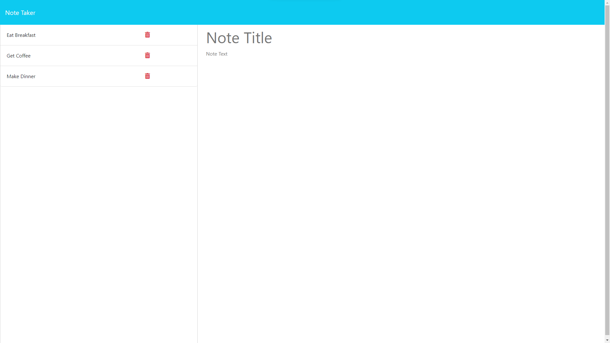
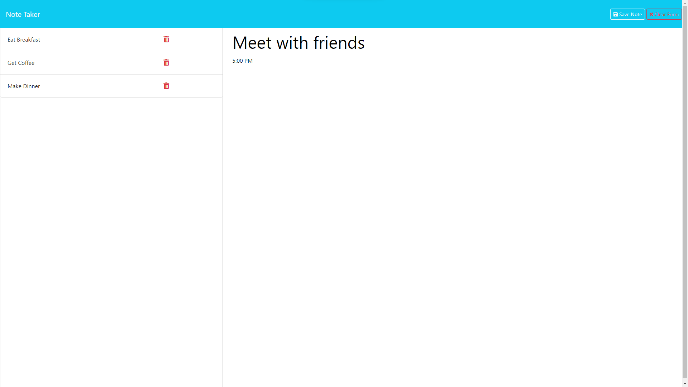

# Note Taker Express.js 

## Description
The Note Taker is a simple yet powerful web application built using Express.js. This application allows users to create, save, and retrieve notes, providing an organized and efficient way to manage information.

## Deployed Application URL / Walkthrough Video
[Note Taker Express.js](https://note-taker-expressjs-1-f32287293c4d.herokuapp.com/)

## Screenshot

## Table of Contents
- [Installation](#installation)
- [Usage](#usage)
- [Test](#test)
- [Contributor Guidelines](#contributor-guidelines)
- [Credits](@credits)
- [License](#license)
- [Questions](#questions)

## Installation
- Clone repository.
- Run npm install to install project dependencies.
- Run npm install express --save-dev to install Express.js packages as a development dependency.
- Run npm install --save-dev nodemon to automatically refresh the server upon changes.
- Run npm install uuid@1 to install the uuid package and generate unique identifiers.

## Usage
- Add note
- Save note
- Retrieve note
- Remove note

## Test
Please follow installation process followed by usage.

## Contributor Guidelines

## Credits
None.

## License

This project is licensed under the [MIT](https://opensource.org/licenses/MIT) license.

## Questions

For any questions or additional information, please contact me:
- [Email](mailto:mariam.miladd@gmail.com?subject=[GitHub]%20Dev%20Connect)
- [GitHub](https://github.com/mariamdawood)